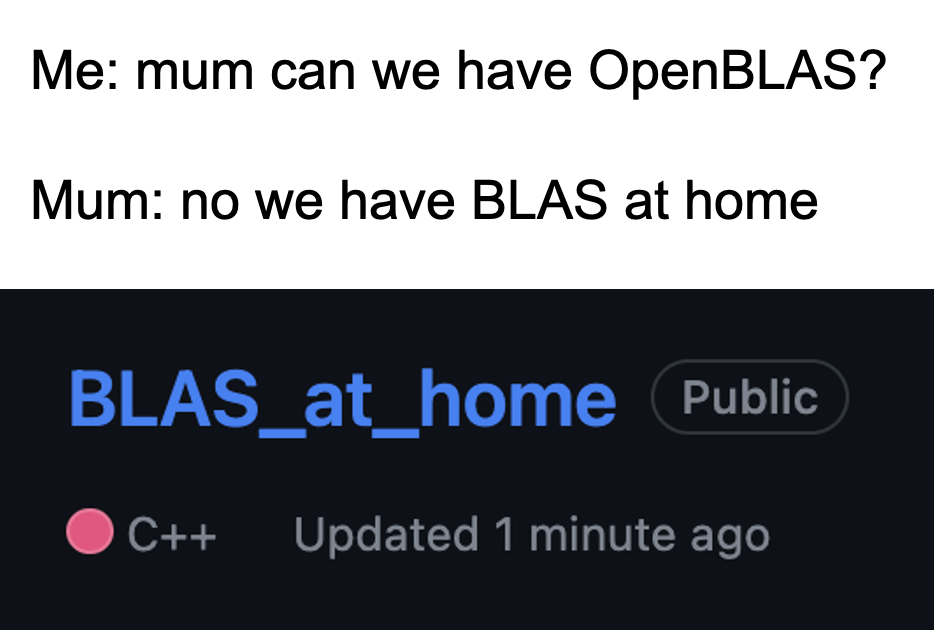

# `bah` (BLAS_at_home)

`bah` is my attempt at implementing BLAS from scratch for fun in pure C++ with no assembly kernels or explicit SIMD through compiler intrinsics. The implementations are tested and benchmarked against [OpenBLAS](https://github.com/OpenMathLib/OpenBLAS).

## Roadmap

- [ ] Phase 1: Naive implementation of all BLAS API functions/routines and test against OpenBLAS with [`googletest`](https://github.com/google/googletest).
- [ ] Phase 2: Optimize the performance of all implementations and measure with google [`benchmark`](https://github.com/google/benchmark).

### [BLAS Level 1 API](https://www.intel.com/content/www/us/en/docs/onemkl/developer-reference-c/2023-2/blas-level-1-routines-and-functions.html)

| Status | Routine or Function Group | Data Types         | Description                                                                                       |
| ------ | ------------------------- | ------------------ | ------------------------------------------------------------------------------------------------- |
| ✅     | cblas\_?asum              | s, d, sc, dz       | Sum of vector magnitudes (functions)                                                              |
| ✅     | cblas\_?axpy              | s, d, c, z         | Scalar-vector product (routines)                                                                  |
| ✅     | cblas\_?copy              | s, d, c, z         | Copy vector (routines)                                                                            |
| ✅     | cblas\_?dot               | s, d               | Dot product (functions)                                                                           |
| ✅     | cblas\_?sdot              | sd, d              | Dot product with double precision (functions)                                                     |
| ✅     | cblas\_?dotc              | c, z               | Dot product conjugated (functions)                                                                |
| ✅     | cblas\_?dotu              | c, z               | Dot product unconjugated (functions)                                                              |
| ✅     | cblas\_?nrm2              | s, d, sc, dz       | Vector 2-norm (Euclidean norm) (functions)                                                        |
| 🚧     | cblas\_?rot               | s, d, c, z, cs, zd | Plane rotation of points (routines)                                                               |
| 🚧     | cblas\_?rotg              | s, d, c, z         | Generate Givens rotation of points (routines)                                                     |
| 🚧     | cblas\_?rotm              | s, d               | Modified Givens plane rotation of points (routines)                                               |
| 🚧     | cblas\_?rotmg             | s, d               | Generate modified Givens plane rotation of points (routines)                                      |
| 🚧     | cblas\_?scal              | s, d, c, z, cs, zd | Vector-scalar product (routines)                                                                  |
| 🚧     | cblas\_?swap              | s, d, c, z         | Vector-vector swap (routines)                                                                     |
| 🚧     | cblas_i?amax              | s, d, c, z         | Index of the maximum absolute value element of a vector (functions)                               |
| 🚧     | cblas_i?amin              | s, d, c, z         | Index of the minimum absolute value element of a vector (functions)                               |
| 🚧     | cblas\_?cabs1             | s, d               | Auxiliary functions, compute the absolute value of a complex number of single or double precision |

### [BLAS Level 2 API](https://www.intel.com/content/www/us/en/docs/onemkl/developer-reference-c/2023-2/cblas-asum.html)

| Status | Routine Groups | Data Types | Description                                                              |
| ------ | -------------- | ---------- | ------------------------------------------------------------------------ |
| 🚧     | cblas\_?gbmv   | s, d, c, z | Matrix-vector product using a general band matrix                        |
| 🚧     | cblas?\_gemv   | s, d, c, z | Matrix-vector product using a general matrix                             |
| 🚧     | cblas\_?ger    | s, d       | Rank-1 update of a general matrix                                        |
| 🚧     | cblas\_?gerc   | c, z       | Rank-1 update of a conjugated general matrix                             |
| 🚧     | cblas\_?geru   | c, z       | Rank-1 update of a general matrix, unconjugated                          |
| 🚧     | cblas\_?hbmv   | c, z       | Matrix-vector product using a Hermitian band matrix                      |
| 🚧     | cblas\_?hemv   | c, z       | Matrix-vector product using a Hermitian matrix                           |
| 🚧     | cblas\_?her    | c, z       | Rank-1 update of a Hermitian matrix                                      |
| 🚧     | cblas\_?her2   | c, z       | Rank-2 update of a Hermitian matrix                                      |
| 🚧     | cblas\_?hpmv   | c, z       | Matrix-vector product using a Hermitian packed matrix                    |
| 🚧     | cblas\_?hpr    | c, z       | Rank-1 update of a Hermitian packed matrix                               |
| 🚧     | cblas\_?hpr2   | c, z       | Rank-2 update of a Hermitian packed matrix                               |
| 🚧     | cblas\_?sbmv   | s, d       | Matrix-vector product using symmetric band matrix                        |
| 🚧     | cblas\_?spmv   | s, d       | Matrix-vector product using a symmetric packed matrix                    |
| 🚧     | cblas\_?spr    | s, d       | Rank-1 update of a symmetric packed matrix                               |
| 🚧     | cblas\_?spr2   | s, d       | Rank-2 update of a symmetric packed matrix                               |
| 🚧     | cblas\_?symv   | s, d       | Matrix-vector product using a symmetric matrix                           |
| 🚧     | cblas\_?syr    | s, d       | Rank-1 update of a symmetric matrix                                      |
| 🚧     | cblas\_?syr2   | s, d       | Rank-2 update of a symmetric matrix                                      |
| 🚧     | cblas\_?tbmv   | s, d, c, z | Matrix-vector product using a triangular band matrix                     |
| 🚧     | cblas\_?tbsv   | s, d, c, z | Solution of a linear system of equations with a triangular band matrix   |
| 🚧     | cblas\_?tpmv   | s, d, c, z | Matrix-vector product using a triangular packed matrix                   |
| 🚧     | cblas\_?tpsv   | s, d, c, z | Solution of a linear system of equations with a triangular packed matrix |
| 🚧     | cblas\_?trmv   | s, d, c, z | Matrix-vector product using a triangular matrix                          |
| 🚧     | cblas\_?trsv   | s, d, c, z | Solution of a linear system of equations with a triangular matrix        |

### [BLAS Level 3 API](https://www.intel.com/content/www/us/en/docs/onemkl/developer-reference-c/2023-2/blas-level-3-routines.html)

| Status | Routine Group | Data Types | Description                                                            |
| ------ | ------------- | ---------- | ---------------------------------------------------------------------- |
| 🚧     | cblas\_?gemm  | s, d, c, z | Computes a matrix-matrix product with general matrices.                |
| 🚧     | cblas\_?hemm  | c, z       | Computes a matrix-matrix product where one input matrix is Hermitian.  |
| 🚧     | cblas\_?herk  | c, z       | Performs a Hermitian rank-k update.                                    |
| 🚧     | cblas\_?her2k | c, z       | Performs a Hermitian rank-2k update.                                   |
| 🚧     | cblas\_?symm  | s, d, c, z | Computes a matrix-matrix product where one input matrix is symmetric.  |
| 🚧     | cblas\_?syrk  | s, d, c, z | Performs a symmetric rank-k update.                                    |
| 🚧     | cblas\_?syr2k | s, d, c, z | Performs a symmetric rank-2k update.                                   |
| 🚧     | cblas\_?trmm  | s, d, c, z | Computes a matrix-matrix product where one input matrix is triangular. |
| 🚧     | cblas\_?trsm  | s, d, c, z | Solves a triangular matrix equation.                                   |

## References

CBLAS API: https://www.intel.com/content/www/us/en/docs/onemkl/developer-reference-c/2023-2/blas-and-sparse-blas-routines.html
